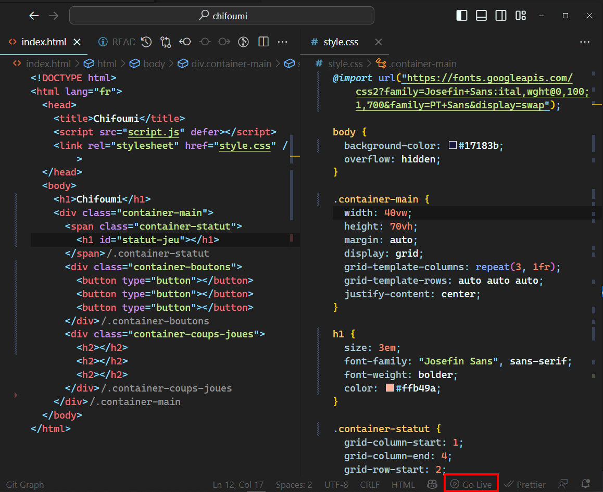
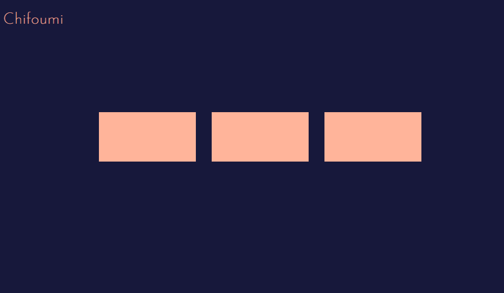
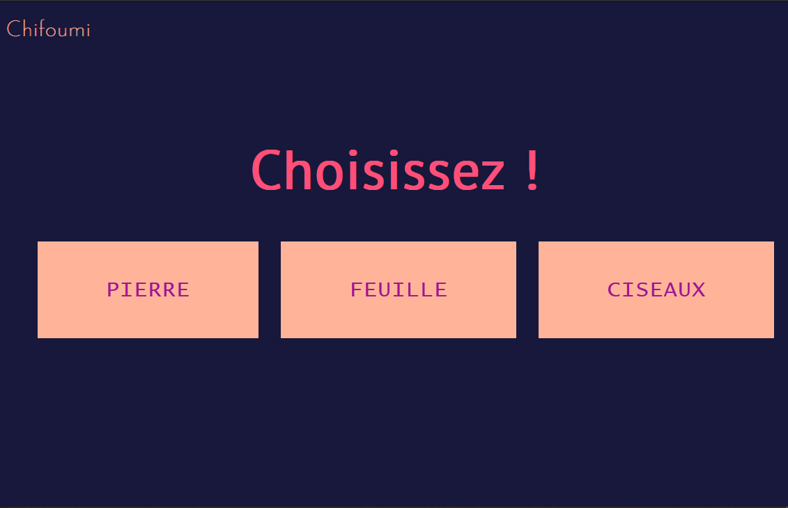
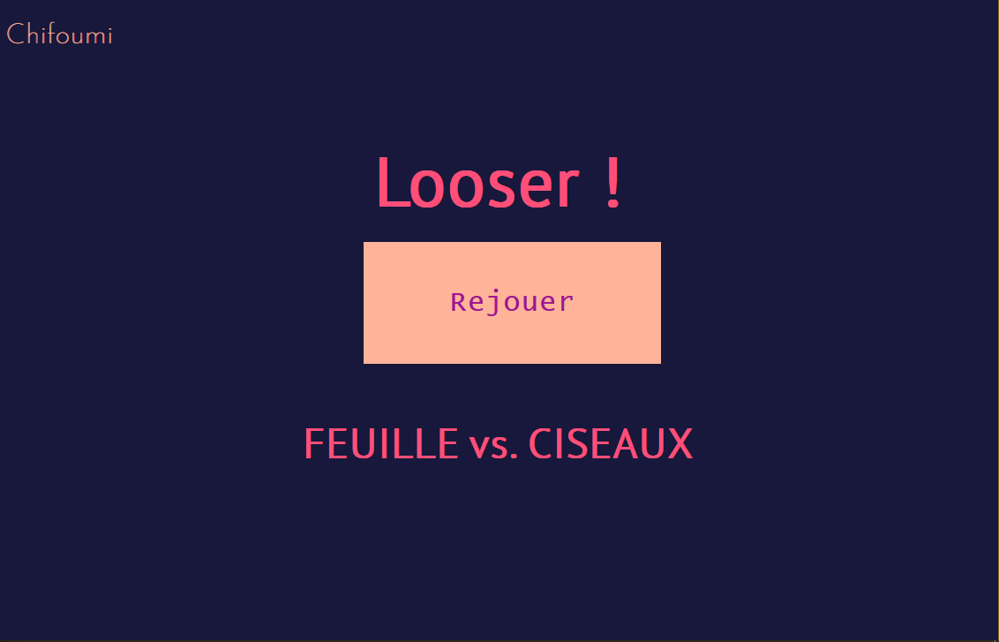
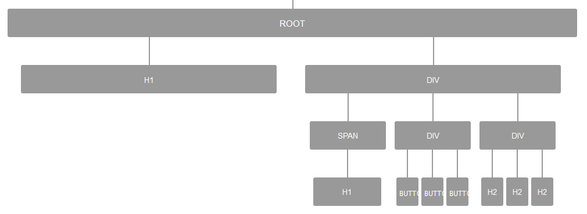
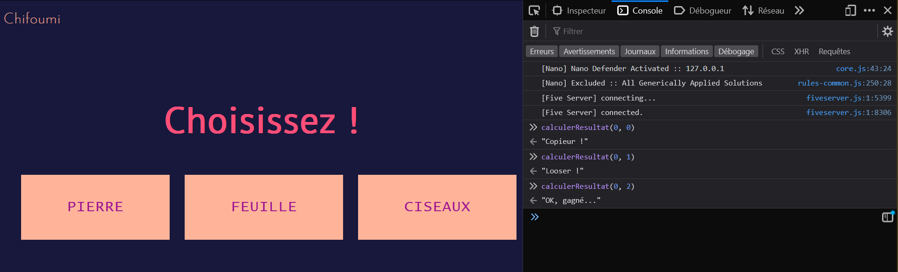
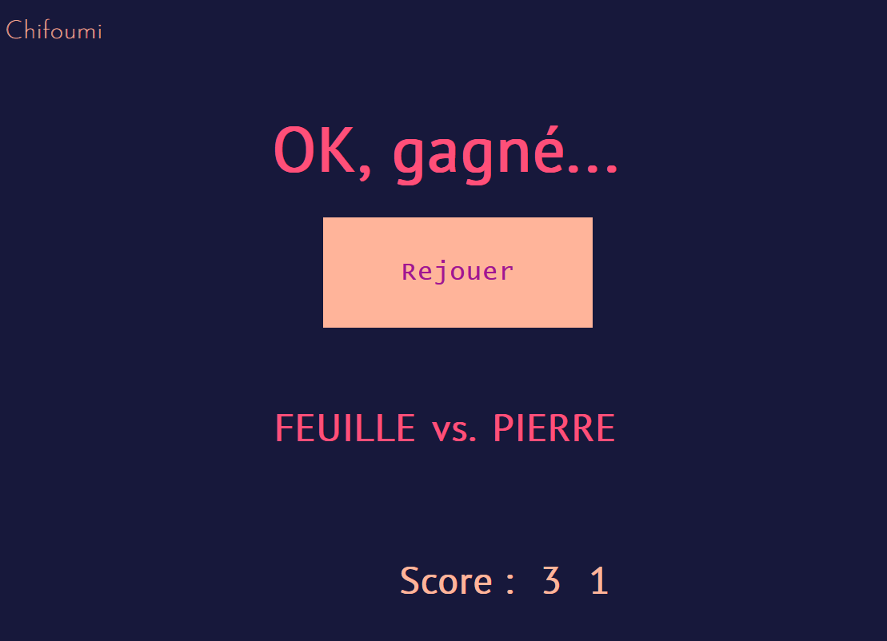

# TP Introduction à JavaScript - Chifoumi

## Introduction

Ce TP est une introduction à la programmation en JavaScript. JavaScript est un langage essentiel car il est utilisé dans tous les navigateurs web. C'est grâce à lui que l'on peut interagir programmatiquement avec les pages web « côté client » (au sens _client/serveur_, le client étant ici le navigateur web).

Pour illustrer l'intérêt de JavaScript, nous allons réaliser un jeu de chifoumi (« pierre, feuille, ciseaux ») contre l'ordinateur. Pour ceux qui auraient vécu enfermés dans une boîte hermétique avec des biscottes jusqu'à aujourd'hui, le chifoumi est un jeu de mains où deux joueurs choisissent l'une des trois options suivantes : pierre, feuille ou ciseaux. Le gagnant est celui qui a choisi l'option qui bat l'option choisie par l'adversaire. La pierre bat les ciseaux, la feuille bat la pierre et les ciseaux battent la feuille.

Le programme va donc s'exécuter sur le navigateur web de l'utilisateur. JavaScript va nous permettre de manipuler les éléments HTML de la page web et de réagir aux actions de l'utilisateur. Cela nous changera de la console de sortie de Java ;)

## Projet de départ

Créez un répertoire pour votre projet, par exemple _tp_chifoumi_. Pour ce projet web client simple, vous n'aurez pas besoin de lancer une procédure de construction de projet initial (comme avec Maven). Vous démarrerez juste à partir du code HTML suivant, que vous placerez dans un fichier `index.html` :

```html
<!DOCTYPE html>
<html lang="fr">
  <head>
    <title>Chifoumi</title>
    <script src="script.js" defer></script>
    <link rel="stylesheet" href="style.css" />
  </head>
  <body>
    <h1>Chifoumi</h1>
    <div class="container-main">
      <span class="container-statut">
        <h1 id="statut-jeu"></h1>
      </span>
      <div class="container-boutons">
        <button type="button"></button>
        <button type="button"></button>
        <button type="button"></button>
      </div>
      <div class="container-coups-joues">
        <h2></h2>
        <h2></h2>
        <h2></h2>
      </div>
    </div>
  </body>
</html>
```

Il n'est pas nécessaire de modifier ce code pour réaliser la majeure TP. Vous pouvez néanmoins le modifier pour réorganiser ou bien ajouter des éléments graphiques (par exemple, un fond d'écran, des couleurs, des images, etc.). Je vous encourage bien sûr à tester/expérimenter selon vos envies. Il sera aussi nécessaire de modifier le HTML pour implémenter les nouvelles fonctionnalités demandées dans à partir de la section « Ajout des scores ».

Le fichier `style.css` suivant contient le code CSS nécessaire pour que la page web soit correctement affichée. De même, vous pouvez le modifier pour changer l'apparence de la page web, mais ce n'est pas nécessaire pour réaliser le TP.

```css
@import url("https://fonts.googleapis.com/css2?family=Josefin+Sans:ital,wght@0,100;1,700&family=PT+Sans&display=swap");

body {
  background-color: #17183b;
  overflow: hidden;
}

.container-main {
  width: 40vw;
  height: 70vh;
  margin: auto;
  display: grid;
  grid-template-columns: 1fr 1fr 1fr;
  grid-template-rows: 1fr 1fr 1fr;
  justify-content: center;
}

h1 {
  size: 3em;
  font-family: "Josefin Sans", sans-serif;
  font-weight: bolder;
  color: #ffb49a;
}

.container-statut {
  grid-column-start: 1;
  grid-column-end: 4;
  grid-row-start: 1;
  display: flex;
  align-items: flex-end;
  justify-content: space-around;
}

.container-statut h1 {
  font-family: "PT Sans", sans-serif;
  font-size: 5em;
  margin-bottom: auto;
  color: #ff4f79;
}

.container-boutons {
  grid-row-start: 2;
  grid-column: 1 / span 3;
  display: flex;
  align-items: flex-start;
  justify-content: space-around;
}

button {
  margin-top: auto;
  color: #a11692;
  margin: 0;
  background-color: #ffb49a;
  border: 2px solid rgba(255, 255, 255, 0);
  border-radius: 0px;
  padding: 1.5em 3em;
  display: inline-block;
  font-family: "Lucida Console", Monaco, monospace;
  font-size: 2em;
  letter-spacing: 1px;
  cursor: pointer;
  margin-left: 1em;
}

button:hover,
button:active {
  border: 5px solid #ff4f79;
  border-radius: 4%;
}

.container-coups-joues {
  grid-row-start: 3;
  grid-column: 1 / span 3;
  color: #ff4f79;
  font-family: "PT Sans", sans-serif;
  font-size: 2em;
  display: flex;
  align-items: flex-start;
  justify-content: space-around;
}

@media (max-width: 1000px) {
  .container-main {
    width: 80vw;
  }
}
```

La page web créée permet au joueur d'interagir avec le jeu. Les différents éléments de la page web peuvent être utilisés pour soumettre des entrées ou afficher des sorties. Commençons par regarder le code source et par quelques rappels.

Chaque page HTML commence généralement par une déclaration `<!DOCTYPE html>` pour aider le navigateur à identifier le type de document. Tout le contenu est dans les balises `<html></html>`. La balise `<head>` contient des métadonnées sur la page, du contenu qui n'est pas affiché par le navigateur. La balise `<body>` contient du contenu qui est affiché par le navigateur et directement visible par l'utilisateur.

Dans ce TP, `<head>` contient les éléments suivants :

- `<title>` : contient un titre qui est affiché par le navigateur dans l'onglet de la page.
- `<script>` : contient du code JavaScript ou pointe vers un autre fichier avec du code Javascript. Dans ce TP, tout le JavaScript sera écrit dans un autre fichier (créé dans une étape ultérieure). Une fois que le fichier/code est chargé par le navigateur, le JavaScript est exécuté.
- `<link>` : permet de lier un fichier CSS à la page HTML. Le fichier CSS contient le code CSS nécessaire pour que la page web soit correctement affichée.

Ouvrez le fichier HTML. Vous pouvez directement l'ouvrir dans votre navigateur en faisant un clic droit sur le fichier et en sélectionnant « Ouvrir avec » puis en sélectionnant votre navigateur préféré.

Une meilleure option lorsque l'on développe une page web est d'utiliser une extension VS Code qui permet de lancer un serveur local. Cela permet de voir les changements en temps réel sans avoir à recharger la page à chaque fois. Pour cela, vous pouvez installer l'extension _Five Server_ (meilleure que la populaire _Live Server_). Une fois l'extension installée, vous pouvez lancer le serveur en cliquant sur le bouton _Go Live_ dans la barre d'état en bas de VS Code (assurez-vous auparavant que le fichier HTML est ouvert dans l'éditeur de texte).

<br>



<br>

La page web devrait actuellement ressembler à ceci :

<br>



<br>

Il ne s'y passe pas grand chose pour le moment, mais c'est tout à fait normal. Nous allons ajouter du contenu et des fonctionnalités grâce au script JavaScript que nous allons créer.

## Page web finale

Certains éléments dans le `<body>` ne sont pas visibles dans la page web que vous venez de voir car ils ne contiennent pas de texte ou ont leur propriété CSS `display` définie sur `hidden` (« caché »). Voici ce à quoi ressemblera la page web finale :

<br>





<br>

Les éléments dans `<body>` seront visibles soit dans l'état de départ, soit dans l'état de fin du jeu (illustrés par les deux images). Dans le code JavaScript, les éléments peuvent être identifiés par leur type (ex. `h1`), leur classe (ex. `.container-main`) ou leur identifiant (ex. `#statut-jeu`). Ces identifiants sont utilisés dans Javascript (comme en CSS) pour faire référence à des éléments individuels, ou à des groupes d'éléments. Parcourez `index.html` et notez divers éléments ainsi que leurs classes et leurs identifiants, s'ils existent.

Passons en revue les éléments avec lesquels nous travaillons :

1. Affichage du statut : ce titre a l'identifiant `#statut-jeu`, il affiche soit l'invite de départ (« Choisissez ! »), soit le résultat de la partie.
2. Boutons : chacun d'eux est un élément `<button>`. Ces boutons vont contenir les entrées possibles. Un clic sur un des boutons mène à la fin de la partie.
3. Affichage du statut (après le choix) : le titre affiche maintenant le résultat du jeu.
4. Boutons (après le choix) : un seul des trois boutons reste visible. Le bouton a maintenant une nouvelle invite (« Rejouer ») dont le clic ramène à l'écran de départ.
5. Affichage des coups joués (après le choix) : ce sont des éléments `<h2>` dans un conteneur avec la classe `.container-coups-joues`. Ils indiquent le coup du joueur et le coup de l'ordinateur. Dans l'état de départ, ces éléments sont masqués.

**Note** : les classes sont référencées en utilisant la syntaxe `.nomClasse` et les identifiants sont référencés en utilisant la syntaxe `#nomId` lors de l'utilisation de sélecteurs CSS (dans les fichiers CSS et JS).

Notre objectif sera de passer d'un état à l'autre lorsque l'action est effectuée (choix du coup ou rejouer). De plus, nous générerons du contenu pour chaque état et mettrons à jour la page web en conséquence.

## Variables globales

JavaScript (JS) est un langage dynamiquement typé. Cela signifie que lors de la déclaration d'une variable, vous n'avez pas à spécifier son type, comme en Java. Le type est déduit de la valeur que l'on affecte à la variable. Il existe six types primitifs en JavaScript. Dans ce TP, nous ne traiterons que des chaînes de caractères, des nombres et des booléens. Nous verrons également des types de données composites tels que les tableaux, les objets et les fonctions.

Nous allons maintenant écrire le script JS associé à notre page web. Créez un nouveau fichier `script.js`. Commençons par y déclarer une variable qui représente la liste des coups possibles, en utilisant un tableau. Un tableau est une structure de données qui permet de ranger ensemble plusieurs valeurs. Notre variable va être utilisée dans plusieurs fonctions (une _fonction_ est l'équivalent d'une _méthode_) du script, c'est pourquoi nous la définissons immédiatement, en dehors de toute fonction. Cela en fait une _variable globales_. En JS, on déclare une variable en utilisant le mot-clé `let` :

```js
let coups = ["PIERRE", "FEUILLE", "CISEAUX"];
```

Ceci définit une variable `coups` qui contient un tableau avec trois chaînes de caractères. Nous pouvons accéder à chaque élément du tableau en utilisant son indice. Par exemple, pour accéder au premier élément du tableau, nous pouvons utiliser `coups[0]`. Notez que les indices commencent à 0.

Cet ajout n'est pas visible sur la page web, mais le navigateur sait maintenant ce que signifie `coups`.

## Fonctions

Comme les variables nous permettent d'organiser nos données, les fonctions nous permettent d'organiser notre code. Les fonctions sont des morceaux de code propres et isolés qui peuvent recevoir des données en entrée. Nous allons utiliser des fonctions pour passer d'un état du jeu à l'autre (du départ à la fin de partie et vice-versa) ainsi que pour réaliser certaines fonctionnalités dans chacun de ces états.

Vous pourrez rencontrer en JS plusieurs façons de définir des fonctions :

```js
// Option 1
function commencerPartie(parametre) {
  // code de la fonction
}

// Option 2
let commencerPartie = function (parametre) {
  // code de la fonction
};

// Option 3 - "arrow function" ("fonction fléchée")
let commencerPartie = (parametre) => {
  // code de la fonction
};
```

Nous allons implémenter les fonctions suivantes :

- `commencerPartie()` : démarre la partie et affiche les prompts d'entrée.
- `finirPartie(event)` : déclenchée par l'entrée utilisateur (choix d'un coup). Calcule et affiche le résultat de la partie.
- `calculerResultat(monCoup, coupOrdi)` : appelée dans `finirPartie()` pour calculer le résultat et le renvoyer sous forme de chaîne de caractères indiquant le message à afficher. Les coups sont des nombres entre 0 et 2 correspondant à l'indice de la liste des coups (variable `coups`). Une victoire est retournée lorsque `monCoup` l'emporte sur le `coupOrdi`.
- `coupAleatoire()` : renvoie un nombre aléatoire entre 0 et 2. Utilisée pour générer le coup de l'ordinateur dans `calculerResultat()`.

Ajoutez le code suivant en dessous du code existant dans `script.js` :

```js
// Appel de la fonction de mise en place d'une nouvelle partie
commencerPartie();

// La suite du script constitue en la définition des fonctions utilisées dans le jeu

/**
 * Calcule le résultat de la partie, ie. le message de victoire, défaite ou égalité
 * @param  {Number}   monCoup  coup du joueur
 * @param  {Number}   coupOrdi  coup de l'ordinateur
 * @return {String}   result le message correspondant au résultat
 */
function calculerResultat(monCoup, coupOrdi) {}

/**
 * @return {Number}   nombre entier aléatoire entre 0 et 2
 */
function coupAleatoire() {
  return Math.floor(Math.random() * 3);
}

/**
 * Mise en place d'une nouvelle partie
 */
function commencerPartie() {}

/**
 * Affiche le résultat final de la partie
 * @param {Event} event événement contenant les informations de l'entrée utilisateur
 */

function finirPartie(event) {}
```

Dans le bloc de code ci-dessus, nous avons défini l'architecture de notre script. La fonction `coupAleatoire()` est déjà implémentée. Elle utilise les fonctions prédéfinies `Math.floor()` et `Math.random()` pour générer un nombre aléatoire entre 0 et 2. Nous appelons la fonction `commencerPartie()` pour démarrer le jeu. Cette fonction sera exécutée dès que le script sera chargé (le fait que la fonction soit _appelée_ avant qu'elle ne soit _définie_ n'est pas un problème en JS).

## Le DOM

Les navigateurs modernes ont de nombreuses fonctionnalités utiles intégrées sous la forme d'APIs (interfaces de programmation). L'une d'entre elles est l'interface _Document Object Model_ (DOM). Le DOM représente le document HTML sous la forme d'un arbre où chaque élément HTML est représenté par un nœud de l'arbre. De plus, nous pouvons modifier le contenu ou les attributs de chaque nœud. Voici une représentation visuelle du DOM de la page `index.html` :

<br>



<br>

Nous pouvons parcourir l'arbre en accédant aux « parents », aux « frères » et aux « enfants » d'un élément. Nous pouvons également récupérer certains éléments en utilisant des fonctions de recherche. Pour obtenir un élément désiré, nous pouvons utiliser `document.querySelector()` qui permet de sélectionner des éléments en utilisant des sélecteurs CSS.

```js
let statutJeu = document.querySelector("#statut-jeu");
```

Ici, nous déclarons une nouvelle variable appelée `statutJeu` et nous stockons le premier élément qui correspond à la requête CSS `#statut-jeu` (c'est-à-dire un élément avec l'identifiant `statut-jeu`).

Si nous voulons accéder à plusieurs éléments correspondant à un critère, par exemple tous les boutons ou tous les `h2` qui sont enfants d'éléments de la classe `.container-coups-joues`, nous pouvons utiliser `document.querySelectorAll()` :

```javascript
let boutons = document.querySelectorAll("button"); // récupère tous les boutons
let affichageCoupsJoues = document.querySelectorAll(
  ".container-coups-joues h2" // récupère tous les h2 qui sont enfants de .container-coups-joues
);
```

Ajoutez ces lignes de code sous la définition de `coups`, au début du script. Ce sont également des variables globales.

Maintenant que nous avons accès aux éléments des nœuds, voyons comment nous pouvons les manipuler.

**Note** : `affichageCoupsJoues` et `boutons` sont des listes d'éléments. Ces listes sont appelées _node lists_ et sont similaires aux tableaux. Pour les besoins de ce TP, vous pouvez les traiter comme des tableaux.

**Note** : nous n'utiliserons ici qu'une fraction de l'API DOM. Pour plus d'informations, consultez la [documentation MDN](https://developer.mozilla.org/fr/docs/Web/API/Document_Object_Model) ou bien, en français, cette [introduction à la manipulation du DOM par Pierre Giraud](https://www.pierre-giraud.com/javascript-apprendre-coder-cours/presentation-dom/).

## Objets

Avant de continuer, précisons ce qu'est en fait un nœud : c'est un _objet_ JavaScript.

Un objet est une collection de propriétés : des paires clé-valeur. Chaque clé a une valeur désignée qui peut stocker un type de données tel qu'un nombre, un autre objet ou même une fonction. Chaque propriété peut être accédée à l'aide de la notation pointée comme suit : `nomObjet.nomPropriete`. De même, une méthode peut être appelée à l'aide de `nomObjet.nomMethode()`. On a déjà un peu expérimenté ça en Java avec l'utilisation du `Scanner` ou lorsqu'on écrit `System.out.println()`.

On a donc vu plus haut un accès à l'objet `document` (qui représente en gros la page web) pour récupérer des éléments, par exemple avec `document.querySelector()`. De même, tous les nœuds du DOM ont diverses propriétés qui peuvent être manipulées pour modifier le DOM.

Ajoutez ce qui suit à la fonction `commencerPartie()` du script :

```js
statutJeu.textContent = "Choisissez !";
```

`statutJeu.textContent` fait référence au texte stocké dans la balise `<h1>` auquel `statutJeu` fait référence. Nous avons mis à jour le texte d'affichage du statut pour afficher le message de départ.

Ouvrez `index.html` dans le navigateur. Comme le script JS est exécuté au chargement de la page, vous devriez maintenant voir le texte « Choisissez ».

## Utilisation de boucles

Nous allons maintenant ajouter le texte de départ des boutons, c'est-à-dire « PIERRE », « FEUILLE » et « CISEAUX », les trois choix possibles. Comme les opérations à effectuer pour chaque bouton sont similaires, il est logique d'utiliser une boucle pour les traiter.

Une boucle en JavaScript peut être définie comme suit :

```js
for (let i = 0; i < 3; i++) {
  // code à exécuter
}
```

Cela ressemble beaucoup à ce qu'on connaît déjà. Nous avons défini une boucle `for` qui exécute le code entre les accolades 3 fois. La variable `i` est incrémentée à chaque itération de la boucle (`i++`). Nous pourrions donc accéder à chaque bouton en utilisant `boutons[i]`.

Que doit-on faire pour chaque bouton ? Mettre à jour le contenu pour afficher le texte correspondant à chaque coup. Voici le code qui correspond :

```js
for (let i = 0; i < 3; i++) {
  boutons[i].textContent = coups[i];
}
```

Nous accédons à la propriété `textContent` de chaque bouton et nous lui affectons la valeur correspondante dans le tableau `coups`.

Une syntaxe alternative pour les boucles `for`, plus moderne, est d'utiliser la fonction `forEach()` des tableaux. Elle prend en paramètre une fonction qui sera exécutée pour chaque élément du tableau (syntaxt d'une _arrow function_). La fonction prend elle-même en paramètre l'élément courant et son index. Voici l'exemple précédent retranscrit en utilisant cette syntaxe :

```js
boutons.forEach((btn, index) => {
  btn.textContent = coups[index];
});
```

Et voici la syntaxe générale :

```js
tableau.forEach(
  // La fonction ci-dessous est exécutée une fois pour chaque élément du tableau
  (elementCourant, compteur) => {
    // Ici on peut accéder à l'élément courant par l'intermédiaire de "elementCourant"
    // et au compteur d'itération avec "compteur" (commence à 0 et incrémenté à chaque itération)
  }
);
```

Ajoutez l'un de ces deux bouts de code à la fin de la fonction `commencerPartie()`. Vérifiez `index.html` dans le navigateur : les boutons devraient afficher les trois choix possibles.

> _**Note importante** : les « exercices » donnés dans ce TP sont là pour ancrer les concepts vus, et pour vous induire à rechercher des solutions (qui sont toujours multiples). Des propositions de solution sont données dans la plupart des cas. Le TP n'est pas noté, le principe étant de vous faire comprendre les concepts et de vous faire pratiquer, donc inutile de se presser en copiant/collant les solutions sans comprendre ce qui se passe ou sans avoir cherché à résoudre par vous-même._

<br>

> **Exercice** : dans `commencerPartie()`, ajoutez une boucle qui met la propriété CSS `display` de chaque élément de `affichageCoupsJoues` à `none`. Cela permettra de cacher les affichages des coups joués au début d'une nouvelle partie.

<br>

<details>
<summary><b>Cliquez pour la solution</b></summary>

<br>

```js
for (let i = 0; i < affichageCoupsJoues.length; i++) {
  affichageCoupsJoues[i].style.display = "none";
}

// ou bien, avec la syntaxe "forEach"
// Ici le compteur n'est pas nécessaire, on peut donc enlever le paramètre
affichageCoupsJoues.forEach((element) => {
  element.style.display = "none";
});
```

</details>

<br>

**Note** : la syntaxe `forEach`, bien que plus difficile à digérer, mène à un code plus concis et plus lisible en général.

Ce dernier ajout ne modifie pas l'affichage actuel de la page, mais il est nécessaire pour la suite, pour « réinitialiser » l'affichage. Pour l'instant, nos boutons ne font toujours rien. Nous allons maintenant les rendre interactifs.

## Événements

En JavaScript, nous pouvons faire en sorte que des fonctions s'exécutent en réponse à certaines actions qui se produisent dans un navigateur. Ces actions sont appelées « événements ». Par exemple : le chargement du document, le défilement de la page ou encore, cas qui nous intéresse ici, le clic sur un bouton.

Un « écouteur d'événements » (_event listener_) est « attaché » à un élément. Il surveille constamment en attendant que l'événement particulier se produise et appelle une fonction spécifique lorsque cet événement est déclenché. L'événement lui-même est un objet avec des informations utiles que l'on peut optionnellement récupérer (par exemple, si on veut connaître l'emplacement précis du clic).

Voici comment ajouter un _event listener_ correspondant à un clic sur un élément appelé `monBouton` :

```js
monBouton.addEventListener("click", () => {
  // code à exécuter lors du clic sur "monBouton"
});
```

Ici, la fonction à exécuter est une _arrow function_ dite **anonyme**. Nous pourrions aussi définir une fonction déjà existante à la place.

<br>

> **Exercice** : dans `commencerPartie()`, ajoutez un _event listener_ à chacun des trois boutons de choix de coup. Il faut réagir à l'événement « *click* » et la fonction à appeler lors du clic est `finirPartie`.

<br>

<details>
<summary><b>Cliquez pour la solution</b></summary>

<br>

On peut réutiliser la boucle précédente pour ajouter les _event listeners_, plutôt que de faire une nouvelle boucle :

```js
for (let i = 0; i < boutons.length; i++) {
  boutons[i].textContent = coups[i];
  boutons[i].addEventListener("click", finirPartie);
}

// ou bien, avec la syntaxe "forEach"
boutons.forEach((btn, index) => {
  btn.textContent = coups[index];
  btn.addEventListener("click", finirPartie);
});
```

</details>

<br>

Notez que quand les fonctions sont paramètres d'autres fonctions, on omet les parenthèses après leur nom (`finirPartie` et non `finirPartie()`).

## Calcul du résultat d'une partie

Il va nous falloir des structures conditionnelles pour implémenter la logique du jeu (qui a gagné ?). La syntaxe du `if` est tout à fait similaire à celle de Java :

```js
if (condition) {
  // code à exécuter si la condition est vraie
} else {
  // code à exécuter si la condition est fausse
}
```

Comme en Java, la partie `else` est optionnelle, et on peut aussi tester plusieurs conditions à la suite avec `else if`, en fonction de la logique souhaitée.

Concernant les tests d'égalité, il faut utiliser le double égal (`==`) pour tester l'égalité de valeur, et le triple égal (`===`) pour tester l'égalité de valeur et de type. Le triple égal est recommandé, car il évite des erreurs de logique. Exemples :

```js
console.log(1 === 1); // true
console.log("coucou" === "coucou"); // true
console.log("1" == 1); // true
console.log("1" === 1); // false
console.log(0 == false); // true
console.log(0 === false); // false
```

**Note** : `console.log()` est le `println()` de JS. Il permet d'afficher des informations dans la console du navigateur. N'hésitez pas à placer des `console.log()` dans vos fonctions pour tracer l'avancée de votre programme et les valeurs de vos variables. Pour visualiser la console du navigateur (ainsi que tout un tas d'informations utiles au développement), il faut utiliser les « *Dev Tools* » (touche F12 dans la plupart des navigateurs) et localiser l'onglet « Console ».

<br>

**Exercice** : implémentez la fonction `calculerResultat(monCoup, coupOrdi)`, documentée dans le code fournie. Prenez bien note du fait que les deux coups en entrées sont des nombres (0, 1 ou 2) et que la fonction doit renvoyer une chaîne de caractères.

<br>

<details>
<summary><b>Cliquez pour la solution</b></summary>

<br>

Il y a bien sûr de multiples façon d'implémenter cette fonction. On peut être très explicite et énumérer tous les cas possibles, ce qui a le mérite d'être très clair :

```js
function calculerResultat(monCoup, coupOrdi) {
  if (monCoup === coupOrdi) {
    return "Copieur !";
  } else if (monCoup === 0) {
    if (coupOrdi === 2) {
      return "OK, gagné...";
    } else {
      return "Looser !";
    }
  } else if (monCoup === 1) {
    if (coupOrdi === 0) {
      return "OK, gagné...";
    } else {
      return "Looser !";
    }
  } else if (monCoup === 2) {
    if (coupOrdi === 1) {
      return "OK, gagné...";
    } else {
      return "Looser !";
    }
  }
}
```

Comme on peut faire des `return` immédiats, on peut aussi se passer de tous les `else`, comme dans la version suivante. Cette version utilise également des variables pour stocker les messages de victoire, défaite et égalité (bonne pratique) :

```js
function calculerResultat(monCoup, coupOrdi) {
  let msgVictoire = "OK, gagné...";
  let msgDefaite = "Looser !";
  let msgEgalite = "Copieur !";

  if (monCoup === coupOrdi) return msgEgalite;
  if (monCoup === 0) {
    if (coupOrdi === 2) return msgVictoire;
    return msgDefaite;
  }
  if (monCoup === 1) {
    if (coupOrdi === 0) return msgVictoire;
    return msgDefaite;
  }
  if (coupOrdi === 1) return msgVictoire;
  return msgDefaite;
}
```

On peut aussi « faire le malin » et utiliser la comparaison des indices du tableau `coups` pour déterminer le résultat. Les indices de chaque coup permettent en effet de dégager le vainqueur par un calcul arithmétique « simple » :

```js
function calculerResultat(monCoup, coupOrdi) {
  let msgVictoire = "OK, gagné...";
  let msgDefaite = "Looser !";
  let msgEgalite = "Copieur !";

  if (monCoup === coupOrdi) return msgEgalite;
  if (coups.indexOf(monCoup) === (coups.indexOf(coupOrdi) + 1) % 3) {
    return msgVictoire;
  }
  return msgDefaite;
}
```

Cette version, bien que plus compacte, est moins lisible et moins facile à maintenir. On peut aussi se demander si le fait de dépendre de l'ordre des éléments du tableau `coups` est une bonne idée (cet ordre pourrait être modifié).

</details>

<br>

Pour tester la fonction `calculerResultat()`, on peut utiliser la console du navigateur :

```js
console.log(calculerResultat("pierre", "pierre")); // Copieur !
console.log(calculerResultat("pierre", "feuille")); // Looser !
console.log(calculerResultat("pierre", "ciseaux")); // OK, gagné...
```

**Note** : plutôt que de faire ces appels à partir du script, on peut aussi utiliser directement la console du navigateur :



L'évaluation directe dans la console est très pratique et conseillée pour tester des bouts de code, et pour débugger.

La fonction `calculerResultat()` est maintenant implémentée, mais on ne l'utilise pas encore dans la logique de jeu.

## Fin de partie

Souvenez-vous que, grâce aux _event listeners_ mis en place, la fonction `finirPartie()` est appelée lorsque le joueur a joué son coup. La fonction doit afficher le résultat de la partie, les coups joués par les deux joueurs, et proposer une nouvelle partie. Voici le canevas de la fonction :

```js
/**
 * Affiche le résultat final de la partie
 * @param {Event} event événement contenant les informations de l'entrée utilisateur
 */
function finirPartie() {
  // On récupère le coup joué par le joueur
  let monCoup = coups.indexOf(event.target.textContent);

  // On génère un coup aléatoire pour l'ordinateur

  // On calcule le résultat de la partie et on l'affiche dans "statutJeu"

  // On affiche les coups joués par les deux joueurs dans les éléments "affichageCoupsJoues" sous la forme "monCoup" "vs." "coupOrdi"

  // On cache les 1er et 3ème boutons de jeu

  // On modifie le texte du bouton de nouvelle partie (2ème bouton) pour afficher "Rejouer"

  // On supprime l'event listener existant sur le bouton "Rejouer"
  boutons[1].removeEventListener("click", finirPartie);

  // On ajoute un event listener sur le bouton "Rejouer" qui renvoie vers la fonction "commencerPartie"
}
```

Quelques explications :

- Fonction `finirPartie()` : le paramètre `event` contient l'objet événement qui a déclenché la fonction. Dans notre cas, l'événement est le clic du joueur sur un bouton correspondant à son coup.
- `let monCoup = coups.indexOf(event.target.textContent);` : `event.target` fait référence à l'élément associé à l'événement, c'est-à-dire le bouton cliqué. `event.target.textContent` va spécifiquement chercher le texte du bouton. On utilise ensuite `coups.indexOf()` pour trouver où se trouve le coup joué par le joueur dans le tableau `coups`, et donc obtenir le coup sous la forme d'un nombre entre 0 et 2.
- Pour générer le coup de l'ordinateur, on a déjà une fonction implémentée qu'on peut utiliser.
- Pour calculer le résultat de la partie, on a déjà une fonction aussi.
- Pour afficher les deux coups joués et le « *vs.* », on doit rendre visible les éléments de `affichageCoupsJoues` et affecter les valeurs correspondantes à leur `textContent`.

<br>

**Exercice** : complétez la fonction `finirPartie()`.

<br>

<details>
<summary><b>Cliquez pour la solution</b></summary>

<br>

```js
/**
 * Affiche le résultat final de la partie
 * @param {Event} event événement contenant les informations de l'entrée utilisateur
 */
function finirPartie(event) {
  // On récupère le coup joué par le joueur
  let monCoup = coups.indexOf(event.target.textContent);

  // On génère un coup aléatoire pour l'ordinateur
  let coupOrdi = coupAleatoire();

  // On calcule le résultat de la partie et on l'affiche dans "statutJeu"
  statutJeu.textContent = calculerResultat(monCoup, coupOrdi);

  // On affiche les coups joués par les deux joueurs dans les éléments "affichageCoupsJoues"
  // sous la forme "monCoup" "vs." "coupOrdi"
  affichageCoupsJoues[0].style.display = "inline-block";
  affichageCoupsJoues[0].textContent = coups[monCoup];
  affichageCoupsJoues[1].style.display = "inline-block";
  affichageCoupsJoues[1].textContent = "vs.";
  affichageCoupsJoues[2].style.display = "inline-block";
  affichageCoupsJoues[2].textContent = coups[coupOrdi];

  // On cache les 1er et 3ème boutons de jeu
  boutons[0].style.display = "none";
  boutons[2].style.display = "none";

  // On modifie le texte du bouton de nouvelle partie (2ème bouton) pour afficher "Rejouer"
  boutons[1].textContent = "Rejouer";

  // On supprime l'event listener existant sur le bouton "Rejouer"
  boutons[1].removeEventListener("click", finirPartie);

  // On ajoute un event listener sur le bouton "Rejouer" qui renvoie vers la fonction "commencerPartie"
  boutons[1].addEventListener("click", commencerPartie);
}
```

</details>

<br>

## Correction de bug

Le programme est quasiment terminé. Il reste cependant un bug à corriger, sauf si vous l'avez déjà identifié et corrigé de vous-même...

<br>

**Exercice** : identifiez le bug et corrigez-le le cas échéant.

<br>

<details>

<summary><b>Indice bug</b></summary>

<br>

Bug : lorsque l'on rejoue, seul le bouton « *FEUILLE* » est visible. Cela est dû au fait que les 1er et 3ème boutons de choix ont été cachés à la fin de la partie.

</details>

<br>

<details>

<summary><b>Indice correction</b></summary>

<br>

Correction : dans `commencerPartie()`, on ajoute une ligne de code pour rendre les trois boutons visibles dans la première boucle.

</details>

<br>

<details>

<summary><b>Solution</b></summary>

<br>

```js
function commencerPartie() {
  statutJeu.textContent = "Choisissez !";

  for (let i = 0; i < boutons.length; i++) {
    boutons[i].textContent = coups[i];
    boutons[i].style.display = "inline-block"; // rend visible tous les boutons
    boutons[i].addEventListener("click", finirPartie);
  }

  for (let i = 0; i < affichageCoupsJoues.length; i++) {
    affichageCoupsJoues[i].style.display = "none";
  }
}
```

</details>

<br>

## Ajout des scores

On veut mettre en place un système de scores. Une victoire rapporte 1 point, un match nul ou une défaite rapportent 0 point. Le score doit s'afficher en bas, dans une nouvelle rangée de la _grid_ CSS, et plutôt vers la droite. Voici ce à quoi ça pourrait ressembler :



<br>

**Exercice** : implémentez cette fonctionnalité.

## Hébergement sur GitHub Pages

On souhaite héberger le jeu en ligne. Comme il s'agit d'un site statique (sans _back-end_), une bonne option est d'utiliser [_GitHub Pages_](https://pages.github.com/). GitHub propose, pour chaque compte, un hébergement associé. De plus, chaque projet (dépôt) peut bénéficier de son propre site.

> _Tout cela fait au passage de GitHub Pages une très bonne option pour héberger votre portfolio (url de type https://pseudogithub.github.io) et construire des mini-sites associés à certains de vos projets (urls de type https://pseudogithub.github.io/dépôt-du-projet)._

Pour héberger votre jeu sur _GitHub Pages_, vous devez d'abord créer un dépôt associé sur GitHub avec votre code. Puis vous pouvez suivre les instructions de la page [GitHub Pages](https://pages.github.com/) en choisissant l'option _Project Site_.

Après déploiement, le jeu doit être jouable en ligne : https://rose-line.github.io/tp-js-chifoumi/

> Il faut patienter un peu pour que la page soit effectivement déployée par GitHub. Rafraîchissez régulièrement la page _Pages_ des _Settings_ jusqu'à ce qu'il vous indique l'url de la page.
